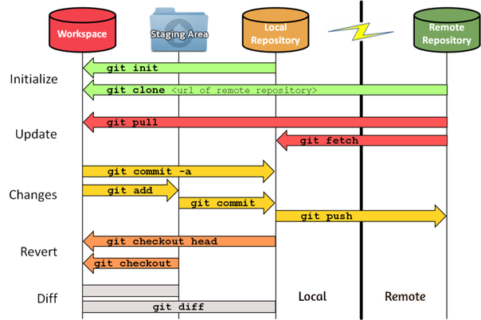
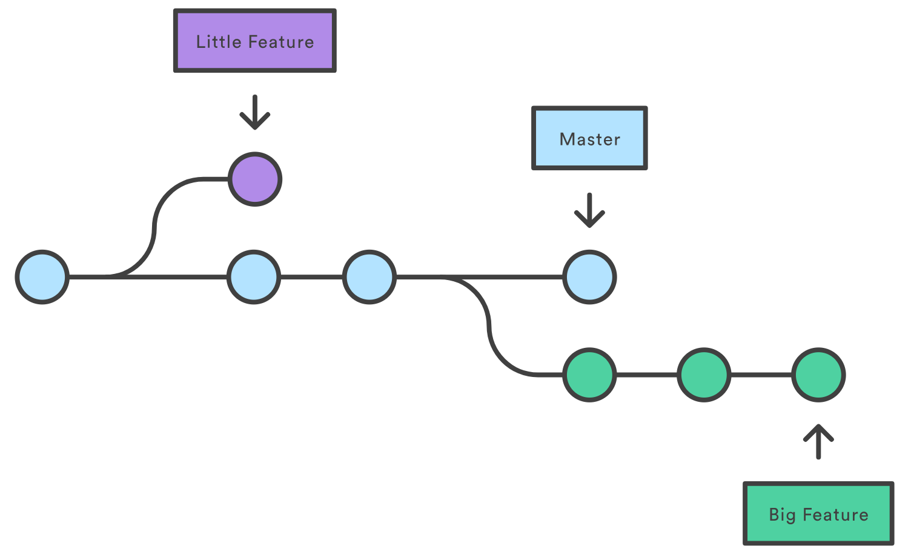

# Gitting Started

## Initializing vs Cloning

There are two different ways to get started in git. Depending on whether you
will be working on something you create from scratch or if you will be starting with
someone else’s work.

* `git init` \- will initialize a new, empty repository.
     
    * What specifically happens when you run `git init`? A `.git` folder is created that stores commits, local config, remote tracking and branching.
        
* `git clone` \- will copy a repository (provided you have permission) to your directory.
    


For this class we will begin with `git init` which will allow us to first become good with our local work, and jump into the complexities later.

The following link will take you through a virtual tour of git, using the major commands covered in this workshop.
Read through the instructions. You can ignore when it asks to set up a code school account, you already have it. Each command is preceded by a description of what it does.

## git help

Another great resource is within git itself. Simply type

```
git help
```

A list of common commands will pop up in your terminal.

For more detail on a particular command just follow git help with the actual command of interest.
To get help on `git add` type:

```
git help add
```

* In groups, you’ll be assigned to a few of the following commands:
  * git init
  * git add
  * git commit
  * git clone
  * git branch
  * git checkout
  * git pull
  * git push
  * git merge

- Take 20 minutes to understand and discuss with your group by using the command `git help` and other resources.
    
- Then, draw a picture or write a description for a presentation on your understand of the assigned commands.

## Staging

`git add` \- This moves your changed files into the staging area.
    
| Git Add Commands | Description |
| --- | --- |
| `git add file-name` | Will stage **only** the changes of the file you specify. |
| `git add .` | Will stage **all** changes. |

Learn all of the features of `git add` in [All the adds lab](gitting-started-labs.md#all_the_adds) 

## Making a Snapshot

`git commit` \- Makes a snapshot of the changes found in the staging area.
   
## Keeping up with changes

`git status` \- A way to check the status of files that have been changed and whether they need to be committed.

## Lab - git intro

We are going to use challenges from Katakoda.com.

Create an account at [Sign Up](https://www.katacoda.com/signup)

Once you have created an account, complete: 

* **[Scenario 1 - Committing Files](https://www.katacoda.com/courses/git/1)** lab.
* **[Scenario 2 - Committing Changes](https://www.katacoda.com/courses/git/2)** lab.

Remember to go off of bandsaw

## Creating and Checking out a Branch

The branches we create using the commands `git branch` and `git checkout -b` are actually pointers to a specific SHA1.

In the image below, the Little Feature contains only the data from the master branches first commit (the first blue dot) and the Big Feature branch contains more information as it was created further down in the history of the project. Both branches point to their own SHA1 which contains this specific information. We’ll drill down into what SHA1 actually is later; for now we’ll stick to talking about branches.



### Creating a new branch

Just like the golden rule on committing your code: Create branches early and often!

`git branch <branch-name>`

When we run the command `git branch`, git **only** creates a branch of the name you choose pointing to a SHA1.

`git checkout -b <branch-name>`
    
When you run the command `git checkout -b`, the `-b` stands for **branch**. We’re actually creating a new branch **and** checking it out, or switching to it.


### Merging

The reason to use the command `git merge` is simply to update one branch with new information from another branch. 

We only use the command `git merge` locally. This means that we never merge **into** the remote origin/master branch repository on GitHub.

To interpret the following illustration, imagine that we’re on our local machines making sure our local master branch is updated (merged) with the data we have in our local feature branch.


But when do we merge changes **from** the remote master branch into our local branch?

Not only do we have to ensure our **local master** branch has the most updated version of our **local feature** branch, we also have to make sure our **local feature** branch has all of the most recent changes made to the **remote origin master repository** (on GitHub, for example) so that when we make our **pull request** there won’t be any merge conflicts.

`git merge`

When we’re working on our local feature branch and run `git merge origin master` we’re merging in any new changes made on the remote repository since we last updated. This has to happen periodically to avoid merge conflicts in the future. The only downside to this practice is that it creates default **merge commit messages**. These messages aren’t helpful in our project’s history and we’ll get to how we clean them up a little later.

Even when merging diligently, merge conflicts still happen occasionally, so we will be able to practice how to resolve them in an exercise.

### Activity: git merge conflicts

[Resolving Merge Conflicts Lab](gitting-started-labs.md#resolving_merge_conflicts)