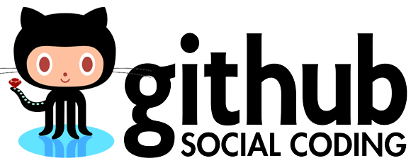
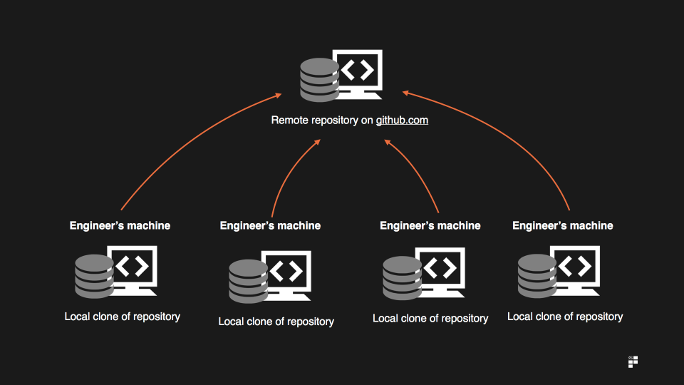

# GitHub Introduction

## Learning Objectives

- Showcase GitHub
- Discuss how to use GitHub effectively
- Explain the GitHub lingo (fork, clone, pull, etc)
    
## Skills

- Integrate GitHub's many helpful features into your projects
- Understand and navigate GitHub's UI
    
## Collaboration

Until now, we have focused primarily on using git locally. Now it's time to talk about collaborating with others to effectively deliver quality software.

It's a very common misconception to think that GitHub is just a part of git. Which is completely understandable. After all, the terms git and GitHub are often used in the same sentence.

How many times have you heard a phrase like Let's commit the code and push it to GitHub ?

In reality GitHub is a tool that leverages and extends Git's capabilities.

GitHub gives us the ability to store our code on the cloud (a server) and provide access to anyone that needs to be involved. Making collaboration on projects much easier.

It's worth noting that alternatives to GitHub do exist. 

GitHub offers an excellent suite of tools to make the entire code-management process simple and efficient.

## How Does GitHub Work?

When using GitHub, we are simply saving our code on a server. You can really think of it as an elaborate form, with your code as the data being submitted.

GitHub will host our code, giving everyone a central access point. Once the code is pushed to GitHub, all collaborators will have immediate access to the changes. Once they are ready, they can pull the code down to their local machines.

GitHub acts as the source of truth for each project and each collaborator's computer acts as a satellite that is linked to the source.
 |

Integrating this into your workflow is easily accomplished with a handful of new git commands…​

- `git clone` \- Pull a repo down to your machine for the first time
- `git push` \- Push new commits to the origin
- `git pull` \- Pull (and merge) changes made by other engineers
- `git fetch` \- Pull (without merging) changes made by other engineers

## Navigating the Interface

Getting started with GitHub couldn't be easier. Just head over to [github.com](https://github.com) and enter your email and password.

Once logged in you'll land on a dashboard. Which can be enabled to operate like a news feed with all activities related to your software projects.