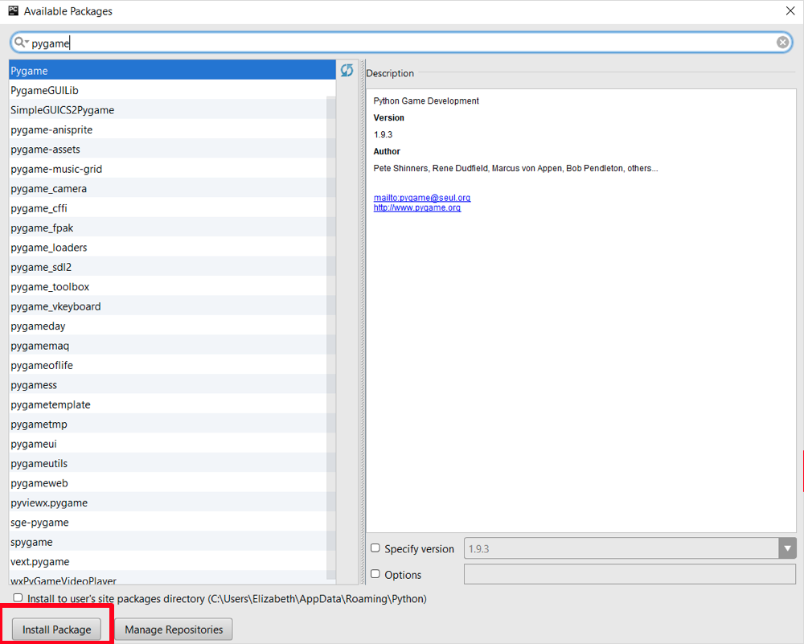
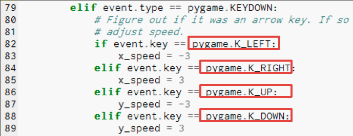
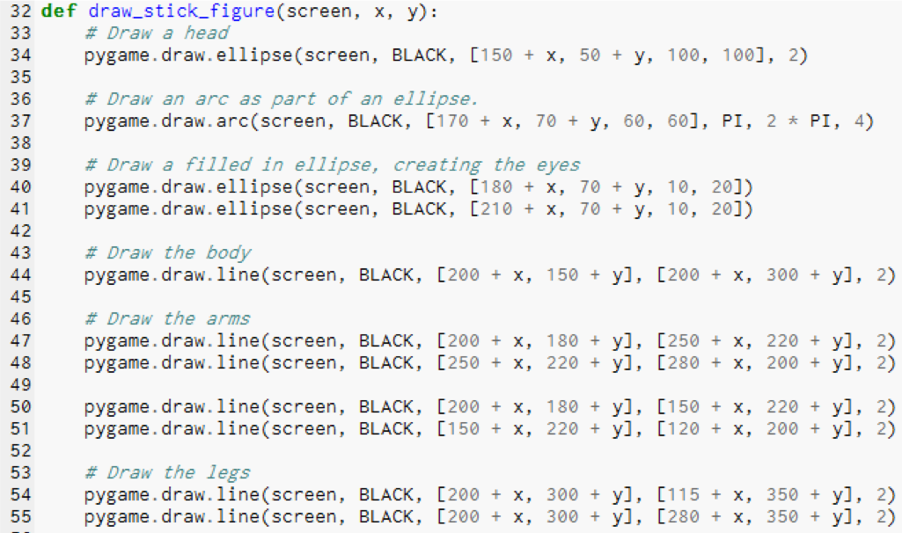

# Intro to pygame

## What is pygame?

Pygame is a set of Python modules designed for writing games, allowing you to create games and multimedia programs in Python 

## What can pygame do?

Pygame: 

* allows you to create games and multimedia programs in the python language 
* is highly portable 
* runs on nearly every platform and operating system
* is free
  
## Set up pygame in PyCharm

In PyCharm: `File` > `Settings` > `Project` > `Project Interpreter`.

Click on the plus sign `+`.


---

Type in pygame then click `Install Package`



---

## Pygame API

Simplest Pygame Program in Steps

**Step 1**

Importing pygame allows us to have access to all of pygame's libraries

```python
import pygame
```

---
**Step 2**

Initialize the Game Engine, starting all actions for PyGame.

```python
pygame.init()
```
---

**Step 3**

Set up the size of the window in pixels.

```python
size = (400, 500)
screen = pygame.display.set_mode(size)
```

---

**Step 3**

Set up the Window's label

```python
pygame.display.set_caption("First Pygame")
```

---

**Step 4**

Create a variable to check to see if the user has click exit or not.

```python
done = False
clock = pygame.time.Clock()
```


---

**Step 5**

Tell the window to remain open until the user exits.

```python
while not done:
 
    for event in pygame.event.get():  # User did something
        if event.type == pygame.QUIT:  # If user clicked close
            done = True  # Flag that we are done so we exit this loop
```

---

**Step 6**

Update the screen to display any new drawings.

```python
pygame.display.flip()
```

---

**Step 7**

Prevent the screen from refreshing every seconds, using a lot of CPU. Limited to 60 refreshes per second will help.

```python
clock.tick(60)
```


---

**Step 8**

**IMPORTANT!**
Tell the program to close when the user has clicked to exit
---

```python
pygame.quit()
```

[Full Code](../programs/pygame_intro.py)


## Let's Draw!

`pygame.draw`

Draw several simple shapes to a Surface. These functions will work for rendering to any format of Surface. Rendering to hardware Surfaces will be slower than regular software Surfaces.


### `pygame.draw` shapes

| Shape | Description |
| --- | --- |
| `pygame.draw.rect` | Draw a rectangle shape |
| `pygame.draw.polygon` | Draw a shape with any number of sides |
| `pygame.draw.circle` | Draw a circle around a point |
| `pygame.draw.ellipse` | Draw a oval shape inside of a rectangle |
| `pygame.draw.arc` | Draw a partial section of an ellipse |
| `pygame.draw.line` | Draw a straight line segment |
| `pygame.draw.lines` | Draw multiple contiguous line segments |

#### `pygame.draw.rect`

```python
pygame.draw.rect(Surface, color, Rect, width=0)

# Draw a rectangle outline
pygame.draw.rect(screen, black, [75, 10, 50, 20], 2)

# Draw a solid rectangle
pygame.draw.rect(screen, black, [150, 10, 50, 20])
```
#### `pygame.draw.polygon`

```python
pygame.draw.polygon(Surface, color, pointlist, width=0)

# This draws a triangle using the polygon command
pygame.draw.polygon(screen, black, [[100, 100], [0, 200], [200, 200]], 5)
```
#### `pygame.draw.circle`

```python
pygame.draw.circle(Surface, color, pos, radius, width=0)

# Draw a circle
pygame.draw.circle(screen, blue, [60, 250], 40)
```

#### `pygame.draw.ellipse`
```python
pygame.draw.ellipse(Surface, color, Rect, width=0)

# Draw an ellipse outline, using a rectangle as the outside boundaries
pygame.draw.ellipse(screen, red, [225, 10, 50, 20], 2)
# Draw an solid ellipse, using a rectangle as the outside boundaries
pygame.draw.ellipse(screen, red, [300, 10, 50, 20])
```

#### `pygame.draw.arc`
```python
pygame.draw.arc(Surface, color, Rect, start_angle, stop_angle, width=1)

# Draw an arc as part of an ellipse.
# Use radians to determine what angle to draw.
pygame.draw.arc(screen, black, [210, 75, 150, 125],  0, pi / 2, 2)
pygame.draw.arc(screen, green, [210, 75, 150, 125],  pi / 2, pi, 2)
```
#### `pygame.draw.line`

```python
pygame.draw.line(Surface, color, start_pos, end_pos, width=1)

# Draw on the screen a green line from (0,0) to (50, 30)# 5 pixels wide.
pygame.draw.line(screen, green, [0, 0], [50, 30], 5)
```

#### `pygame.draw.lines```
```python
pygame.draw.lines(Surface, color, closed, pointlist, width=1)

# Draw on the screen a green line from (0,80) to (50,90)
# 5 pixels wide.
pygame.draw.lines(screen, black, False, [[0, 80], [50, 90], [200, 80], [220, 30]], 5)
```

### Pygame Exercise #1 - `smiley.py`

Create a new file, `smiley.py`


Create a smiley face with pygame
Use shapes.py as an example to get started
Remember to change the caption name to Smiley Face

### Pygame Exercise #2 – `stick_figure.py`

Create a new file, `stick_figure.py`


Create a stick figure of yourself with pygame
Use shapes.py as an example to get started
Remember to change the caption name to Stick Figure

## Moving Parts

So far, we have had nothing move in our code. 

That makes for a pretty boring game!

We can add moving parts with PyGame and refreshing our window.


### Working with keyboard input

The following code checks for if an "event" of a key press has occurred.


Once the code knows that a key has been pressed, it checks to see which key is pressed.



Once the key has been pressed, the x and y coordinates are changed accordingly


---

### Challenge: stick_figure_move.py

Compare your `stick_figure.py ` to the code below.



What changes do you see?

Open the python file `stick_figure_move.py`

Use your `stick_figure.py` to grab your drawing code and place it in the function `draw_stick_figure(screen, x, y)`. 
Modify the code you just pasted to move your stick figure.
