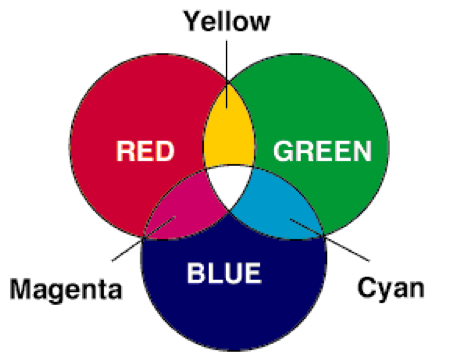

# Pygame Input

## Objects moving on their own

So we can move things with keyboard input, how do you have things moving on their own??

---

**Looking back to `move_stick_figure.py`**

The stick figure needs something to do, so let's add a bouncing ball!

First, make the circle for the ball!

```python
pygame.draw.ellipse(screen, ORANGE, [20, 200, 40, 40])
```

This ball now will start at (`20`, `200`) with a width and height of `40`.

---

### Dynamic Variables

To make the ball move, we need to change the y-value by some variable.

Before the function, `draw_stick_figure`, create a the new variable:

```python
ball_pos = 0
def draw_stick_figure(screen, x, y):
    pygame.draw.ellipse(screen, ORANGE, [20, 200 + ball_pos, 40, 40])
```

### Changing Variables

That code won't do anything until we get `ball_pos` to change. We will do this inside the event while loop:

```python
while not done:
	ball_pos += 1
```

Run your code! Now your ball should be going to the ground!

BUT it does not stop!

We can fix that with an if statement!

### Creating Boundaries

If statement checks to see if the y-value of `ball_pos` is getting past the desired y-value.

```python
while not done:
	ball_pos += 1
	if ball_pos > 250:
		ball_change -= 1
```

### Constant Movement

```python
while not done:
	ball_pos += ball_chg
	if ball_pos > 250:
		ball_chg -= 1
```

Where did this `ball_chg` come from?? This is a new variable that needs to be created. This allows us to change the direction and speed of the ball once it has reached a desired location.

Make sure to create the variable `ball_chg = 1` at the top of the code!

---

Now the ball bounces once and never comes back! Create another if-statement that will check to see if the y-value of the ball is getting too small. If so, then set the direction of `ball_chg` to a positive value!

#### Challenge!

Get the ball to constantly bounce up and down from the stick figure's hand!

## RGB Value

TVs and computer screens display colors by combining Red, Green, Blue light.

This is done with the following format:

`(red, green, blue)`



* `red`/`green`/`blue` are all values between 0 and 255
* (0, 0, 0) represents black
* (255,255,255) represents white

## Input Exercise #1 - Text Color

Open and execute [text_color](../programs/pygame-input/text_color.py)

* What do you see?
* How many times did you push?

The following line is where the text is placed on the window:

```python
text = font.render(TEXT_OUTPUT, true, (0, 0, BLUE_COLOR))
```

The second argument is for **antialias**: a boolean holding if true the characters will have smooth edges.
The color value is `(0,0,[current_blue color])`

---

The following lines create the counterclockwise rotation, turning one degree every:

```python
text = pygame.transform.rotate(text, text_rotate_degrees)
text_rotate_degrees += 1
```

---

Blit: Copying the pixels belonging to said object onto the destination object. 

```python
screen.blit(text, [100, 50])
```

So to render the background object, you blit it onto the screen.

## Input Exercise #2 - Text Color

Open and execute [multi_text_color](../programs/pygame-input/multi_text_color.py)

Let's add multiple buttons! You might need to add code in several different spots! 

This will change, in addition to the blue value, the red and yellow values of the font!

Let's fix it!


## Python Classes - Brief Review

A class is a way to take a grouping of functions and data and place them inside a container so you can access them with the . (dot) operator.

```python
class Person:
    def __init__(self):        
		self.first_name = "Sally"
    	self.age = 10
		
	def have_birthday(self):
		print("I was: " + self.age)
		self.age = self.age + 1    
		print ("I am now: " + self.age)
```


### Default values

When a Person is first created, their default name will be Sally and default age will be 10.

`self` is a "placeholder" for an object's name.

```python
def __init__(self):        
	self.first_name = "Sally"
	self.age = 10
```


### Objects

We have now created a student object. This object's name is `student`.
This object now has all of the variables and functions that the Person class has.

```python
student = Person()
print(student.first_name)
student.have_birthday()
```

`print(student.first_name)` will output the student's name, which is currently "Sally"

`student.have_birthday()` will output:
```
I was 10
I am now 11
```

## Input Exercise #3

Open the file: [sprite_collect_blocks](../programs/pygame-input/sprite_collect_blocks.py)

The constructor sets the default variable values of every block.
The user must specify the color, width and height.

```python
def __init__(self, color, width, height):
	""" Constructor. Pass in the color of the block,
	and its x and y position. """

	# Call the parent class (Sprite) constructor
	pygame.sprite.Sprite.__init__(self)

	# Create an image of the block, and fill it with a color.
	# This could also be an image loaded from the disk.
	self.image = pygame.Surface([width, height])
	self.image.fill(color)

	# Fetch the rectangle object that has the dimensions of the image.
	# Update the position of this object by setting the values of rect.x and rect.y
	self.rect = self.image.get_rect()
```

---

The constructor:

* Sets every `Block` object to be a subclass of the Sprite class, giving it more functions and variables.
* Creates the block image, giving it the specified color
* Sets the blocks x and y values
* Creates 50 randomly located Block objects on the window. Adds new Block objects to the Sprite and Block list
* Creates the player Block object. Adds the player to the Block list
* Set up your circuits to move the block around with the push of a button


# Sources

* Pygame official documentation: http://www.pygame.org/wiki/
* TutorialsPoint definitions: www.tutorialspoint.com/python/
* Pygame tutorial: http://www.balloonbuilding.com/index.php?chapter=example_code
